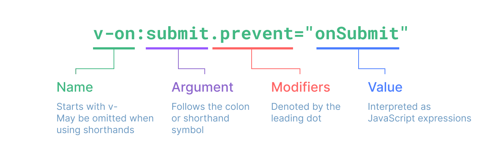
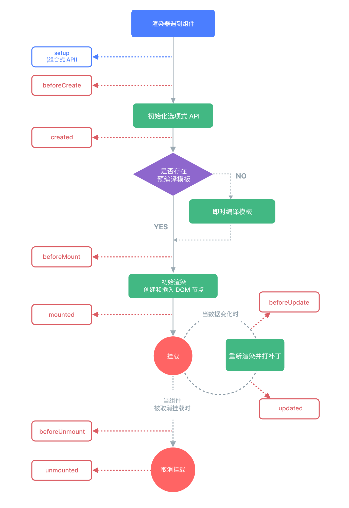

1. 3.4+ attribute支持简写：`<div :id />`， 等同于：`<div :id="id" />`
2. 动态绑定多值：

   ```html
   <script>
     const objectOfAttrs = {
       id: "container",
       class: "wrapper",
       style: "background-color:green",
     };
   </script>

   <div v-bind="objectOfAttrs" />
   ```

3. 仅支持表达式：

   ```html
   <!-- 这是个语句，而非表达式。无效 -->
   {{ var a = 1 }}
   <!-- 条件控制语句也不支持，需使用三元表达式 -->
   {{ if(ok) { return message; } }}
   ```

4. 在绑定表达式中，每次组件的更新都会被重新调用，因此不应该产生任何副作用，比如改变数据或出发异步操作

   ```html
   <time :title="toTitleDate(date)" :datetime="date">
     {{ formatDate(date) }}
   </time>
   ```

5. 模板中的表达式将被沙盒化，仅能够访问到有限的全局对象列表。该列表中会暴露常用的内置全局对象，比如Math和Date。
   没有显式包含在列表中的全局对象将不能在模板内表达式中访问，例如用户附加在window上的属性。然后，我们也可以自行在`app.config.globalProperties`中显式地添加它们，供所有的Vue表达式使用

6. 动态参数：在指令参数上可以使用一个javascript表达式，需要包含在一对方括号中：

   ```html
   <a v-bind:[attributeName]="url"></a>
   <a :[attributeName]="url"></a>
   <a v-on:[eventName]="doSomething"></a>
   <a @[eventName]="doSomething"></a>
   ```

   限制：动态参数中表达式的值应当是一个字符串，或者是null。特殊值null意味着显式移除该绑定。其他非字符串的值会触发警告.

   语法限制：由于某些字符的缘故有一些语法限制，比如空格和引号，在HTML attribute名称中都是不合法的，例如：

   ```html
   <a :['foo' + bar]="value"></a>
   ```

   tip：复杂的动态参数建议使用计算属性

   如果使用DOM内嵌模板（直接写在HTML文件里的模板）时，需要注意避免在名称中使用大写字母，因为浏览器会强制将其转为小写：

   ```html
   <a :[someAttr]="value"></a>
   <!-- 浏览器会转为小写 -->
   <a :[someattr]="value"></a>
   ```

   这将导致代码不会生效（JS中定义的是someAttr属性）。而在SFC中则不会受此限制

7. 修饰符Modifiers，是以点开头的特殊后缀，表明指令需要以一些特殊的方式被绑定。例如`.prevent`修饰符会告知`v-on`指令对触发的事件调用`event.preventDefault()`:

   ```html
   <form @submit.prevent="onSubmit"></form>
   ```

   

8. `ref`
   `ref`在模板中的attribute中使用时，如果它是**顶级参数**，则会自动解构ref，而对象内的的则不会解构，一般可以将对象内的ref在TS中解构为顶级属性

   ```html
   <script>
     const count = ref(0);
     const object = { id: ref(1) };
   </script>

   <!-- 正常工作 -->
   <div :id="count"></div>
   <!-- 结果：[object Object]1 -->
   <div :id="object.id + '1'"></div>
   ```

   对于文本插值则比较特殊，会自动解构：

   ```html
   {{ object.id }}
   <!-- 相当于{{ object.id.value }} -->
   ```

   shadowRef、shadowReactive常用于放弃深层响应式，减少响应式开销来优化性能

9. `reactive`
   为保证访问代理的一致性，对用一个原始对象调用`reactice()`会总是返回同样的代理对象，而对一个已存在的代理对象调用`reactive()`会返回其本身：

   ```js
   const raw = {};
   const proxy = reactive(raw);
   // 代理对象和原始对象不是全等的
   console.log(proxy === raw); // false
   // 在同一个原始对象上调用 reactive() 会返回相同的代理
   console.log(reactive(raw) === proxy); // true
   // 在一个代理上调用 reactive() 会返回它自己
   console.log(reactive(proxy) === proxy); // true
   ```

   这个规则对嵌套对象也适用。依靠深层响应性，响应式对象内的嵌套对象依然是代理：

   ```js
   const proxy = reactive({});
   const raw = {};
   proxy.nested = raw;
   console.log(proxy.nested === raw); // false
   console.log(proxy.nested === proxy); // false
   ```

   局限性：
   1. 有限的值类型：它只能用于对象类型（对象、数组和如`Map`、`Set`这样的集合类型）。它不能持有如`string`、`number`或`boolean`这样的原始类型(`ref`支持所有类型)
   2. 不能替换整个对象：由于Vue的响应式跟踪是通过属性访问实现的，因此我们必须始终保持对响应式对象的相同引用。这意味着我们不能轻易地“替换”响应式对象，因为这样的话与第一个引用的响应式连接将丢失：

      ```js
      let state = reactive({ count: 0 });

      // 上面的 ({ count: 0 }) 引用将不再被追踪
      // (响应性连接已丢失！)
      state = reactive({ count: 1 });
      ```

      (`ref`支持通过`.value`替换对象)

   3. 对解构操作不友好：当我们将响应式对象的原始类型属性解构为本地变量时，或者将该属性传递给函数时，我们将丢失响应式连接。（`ref`支持使用`toRef`或`toRefs`进行解构，解构出`ref`，并保持与原属性的同步）

   由于这些限制，因此更加建议使用`ref()`作为声明响应式状态的主要API

   `reactive`是惰性代理，对于多层嵌套对象，只有在访问到子对象时才会为子对象创建proxy代理

10. 额外的`ref`解构细节

    a. 作为`reactive`对象的属性

    一个`ref`会作为响应式对象的属性被访问或修改时自动解构(getter)，换句话说，它的行为就像一个普通的属性；而当被修改时，则会触发`ref`的setter：

    ```js
    const count = ref(0);
    const state = reactive({
      count,
    });
    console.log(state.count); // 0
    state.count = 1;
    console.log(count.value); // 1
    ```

    如果将一个新的`ref`赋值给一个关联了已有`ref`的属性，那么它会替换掉旧的`ref`：

    ```js
    const otherCount = ref(2);
    state.count = otherCount;
    console.log(state.count); // 2
    // 原始 ref 现在已经和 state.count 失去联系
    console.log(count.value);
    ```

    只有当嵌套在一个深层响应式对象内时，才会发生`ref`解构。当期作为浅层响应式对象(shadowReactive)的属性被访问时不会解构。

    b. 数组和集合的注意事项
    与`reactive`对象不同的是，当`ref`作为响应式数组或原生集合类型（如`Map`）中的元素被访问时，它不会被解构：

    ```js
    const books = reactive([ref("Vue 3 Guide")]);
    // 这里是需要.value
    console.log(books[0].value);

    const map = reactive(new Map([["count", ref(0)]]));
    // 需要.value
    console.log(map.get("count").value);
    ```

11. `computed`方法期望接受一个getter函数，返回值为一个计算属性`ref`，和其他一般的`ref`类似，也会在模板中自动解包。

    计算属性与函数生成区别：计算属性值会基于其响应式依赖被缓存，它仅会在其响应式依赖更新时重新计算。而函数则需多次手动调用。

    计算属性默认是只读属性，但也可以重写属性`getter`和`setter`来创建可写计算属性。

    `3.4`版本支持特性：可以通过访问计算属性的`gettter`的第一个参数来获取计算属性返回的上一个值(旧值)

    最佳实践：`getter`不应该有副作用，只负责计算。不要改变任何其他状态。如果有需要，更加推荐`watch`。

    应避免直接修改计算属性值，计算属性返回的值是派生状态，相当于是源状态的一个“快照”，修改快照是没有意义的。正确思路是通过更新它所依赖的源状态以触发新的计算。

12. 绑定HTML class：

    ```html
    <!-- 绑定对象 -->
    <script>
      const isActive = ref(false);
      const classObject = reactive({
        active: true,
        "text-danger": false,
      });
      const classObjectComp = computed(() => ({
        active: isActive.value && !error.value,
        "text-danger": error.value && error.value.type === "fatal",
      }));
    </script>
    <div :class="{ active: isActive }"></div>
    <div :class="classObject"></div>
    <div :class="classObjectComp"></div>

    <!-- 绑定数组 -->
    <script>
      const activeClass = ref("active");
      const errorClass = ref("text-danger");
    </script>

    <div :class="[activeClass, errorClass]"></div>
    <div :class="[isActive ? activeClass : '', errorClass]"></div>
    <!-- 数组中也支持嵌套对象 -->
    <div :class="[{ [activeClass]: isActive }, errorClass]"></div>
    ```

13. 绑定内联样式

    支持对象绑定、数组对象绑定

    自动前缀：vue会为需要浏览器特殊前缀的css属性自动加上相应的前缀，vue在运行时就会检查属性是否支持当前浏览器，若不支持，则会尝试加上各个浏览器特殊前缀，以找到哪个是被支持的

    样式多值：支持对一个样式属性提供多个（不同前缀的）值：

    ```html
    <div :style="{ display: ['-webkit-box', '-ms-flexbox', 'flex'] }"></div>
    ```

    数组仅会渲染浏览器支持的最后一个值，在上面的示例中，在支持不需要特别前缀的浏览器中都会渲染为`display: flex`。

14. `v-if`优先级比`v-for`高

    `v-for`上的变量别名支持解构：

    ```html
    <li v-for="{ message } in items">{{ message }}</li>

    <li v-for="({ message }, index) in items">{{ message }} {{ index }}</li>
    ```

    `v-for`也可遍历一个对象的所有属性，遍历顺序会基于对该对象调用`Object.values()`的返回值来决定。

    `Object.values()`的顺序优先级：按非负整数递增顺序（负数、浮点数视为字符串） > 字符串按添加顺序 > `Symbol`按添加顺序

    ```html
    <script>
      const myObject = reactive({
        title: "title",
        author: "wcs",
        publishedAt: "xxx",
      });
    </script>
    <ul>
      <li v-for="value in myObject">{{ value }}</li>

      <!-- 第二个参数表示key值 -->
      <li v-for="(value, key) in myObject">{{ key }}: {{ value }}</li>

      <!-- 第三个参数表示index索引 -->
      <li v-for="(value, key, index) in myObject"></li>
    </ul>
    ```

    `v-for`可以接受一个整数值，它会将该模板基于`1...n`的取值范围重复多次

    ```html
    <!-- 特别注意这里的n是从1开始，而不是0 -->
    <span v-for="n in 10"></span>
    ```

    `template`上的使用：`template`上都允许`v-if`和`v-for`的使用，但不支持`v-show`

15. `v-if`和`v-for`

    当它们同时存在于一个节点上时，由于`v-if`比`v-for`的优先级更高，这意味着`v-if`的条件将无法访问到`v-for`作用域内定义的变量别名：

    ```html
    <!-- 抛出错误 -->
    <li v-for="todo in todos" v-if="!todo.isComplete"></li>
    ```

    可以使用`template`来解决这个问题：

    ```html
    <template v-for="todo in todos">
      <li v-if="!todo.isComplete">{{ todo.name }}</li>
    </template>
    ```

    注意：不推荐同时使用这两个指令

16. `v-for`通过`key`来管理状态
    Vue默认按照“就地更新”的策略来更新通过`v-for`渲染的元素列表。当数据项的顺序改变时，Vue不会随之移动DOM元素的顺序，而是就地更新每个元素，确保它们在原本指定的索引位置上渲染。

    默认模式是高效的，但只适用于列表渲染输出的结果不依赖子组件状态或者临时DOM状态（例如表单输入值）的情况

    为了给Vue一个提示，以便它可以跟踪每个节点的标识，从而重用和重新排序现有的元素，需要为每个元素对应的块添加一个唯一的`key`标识。

    当使用了`key`时，Vue不会采用默认模式进行更新，而是利用key进行虚拟DOM的匹配，对DOM进行重用与重新排序。

    当所迭代的DOM内容非常简单（例如：不包含组件或有状态的DOM元素），或者你想有意采用默认行为来提高性能。

17. 为什么不推荐`v-for`和`v-if`同时在一个节点使用

    `Vue2`：

    优先级：`v-for`大于`v-if`

    执行顺序：先执行`v-for`生成多个节点，再对每个元素执行`v-if`

    问题：性能浪费，会先创建`v-for`的每一个元素，再被`v-if`销毁。

    `Vue3`：

    优先级：`v-if`大于`v-for`

    执行顺序：先执行`v-if`，当其为真时才执行`v-for`

    问题：`v-if`无法访问`v-for`的变量。

    共通问题：代码意图模糊，且通常有性能更优、逻辑更清晰的替代方案。

18. 数组变化侦测：

    Vue能侦测响应式数组的变更方法，并在它们被调用时触发相关的更新，包括：
    `push`、`pop`、`shift`、`unshift`、`splice`、`sort`、`reverse`

    Vue允许对响应式数组直接赋值一个新数组，Vue会利用虚拟DOM和diff算法最大化地对DOM元素进行重用，因此直接替换也是一个高效操作。

19. 事件处理

    内联事件处理器：事件被出发时执行的内联JavaScript语句

    方法事件处理器：一个指向组件上定义的方法的属性名或路径

    ```html
    <!-- 内联事件处理器 -->
    <!-- 使用特殊的$event变量 -->
    <button @click="warn('Form cannot be submitted yet.', $event)">
      Submit
    </button>

    <!-- 使用内联箭头函数 -->
    <button @click="(event) => warn('Form cannot be submitted yet.', event)">
      Submit
    </button>

    <script>
      function warn(message, event) {
        /* xxx */
      }
    </script>
    ```

20. 事件修饰符

    `.stop`、`.prevent`、`.self`、`.capture`、`.once`、`.passive`

    ```html
    <!-- 单击事件将停止传递，停止捕获 -->
    <a @click.stop="doThis"></a>

    <!-- 提交事件将不再重新加载页面，停止冒泡 -->
    <form @submit.prevent="onSubmit"></form>

    <!-- 修饰符支持使用链式书写 -->
    <a @click.stop.prevent="doThis"></a>

    <!-- 也可以只有修饰符 -->
    <form @submit.prevent></form>

    <!-- 仅当 event.target 是元素本身时才会触发事件处理器 -->
    <!-- 例如：事件处理器不来自子元素 -->
    <div @click.self="doThat">...</div>
    ```

    使用修饰符时需要注意调用顺序，因为相关代码是以相同的顺序生成的。因此使用 `@click.prevent.self` 会阻止元素及其子元素的所有点击事件的默认行为，而 `@click.self.prevent` 则只会阻止对元素本身的点击事件的默认行为。

    `.capture`、`.once` 和 `.passive` 修饰符与原生 `addEventListener` 事件相对应：

    ```html
    <!-- 添加事件监听器时，使用 `capture` 捕获模式 -->
    <!-- 例如：指向内部元素的事件，在被内部元素处理前，先被外部处理 -->
    <div @click.capture="doThis">...</div>

    <!-- 点击事件最多被触发一次 -->
    <a @click.once="doThis"></a>

    <!-- 滚动事件的默认行为（scrolling）将立即发生而非等待 `onScroll` 完成 -->
    <!-- 以防其中包含 `event.preventDefault()` -->
    <div @scroll.passive="onScroll"></div>
    ```

    `.passive`修饰符一般用于触摸事件的监听器，可以用来改善移动端设备的滚屏性能

    TIP：请勿同时使用 `.passive` 和 `.prevent`，因为 `.passive` 已经向浏览器表明了你不想阻止事件的默认行为。如果你这么做了，则 `.prevent` 会被忽略，并且浏览器会抛出警告。

21. 按键修饰符：

    ```html
    <!-- 仅在 `key` 为 `Enter` 时调用 `submit` -->
    <input @keyup.enter="submit" />
    ```

    你可以直接使用 `KeyboardEvent.key` 暴露的按键名称作为修饰符，但需要转为 `kebab-case` 形式。

    ```html
    <input @keyup.page-down="onPageDown" />
    ```

    在上面的例子中，仅会在 `$event.key` 为 `PageDown` 时调用事件处理。

22. 按键别名：

    `.enter`、`.tab`、`.delete`（捕获“delete”和“Backspace”两个按键）、`.esc`、`.space`、`.up`、`.down`、`.left`、`.right`。

23. 系统按键修饰符：

    `.ctrl`、`.alt`、`.shift`、`.meta`

    ```html
    <!-- Alt + Enter -->
    <input @keyup.alt.enter="clear" />

    <!-- Alt + 点击 -->
    <div @click.ctrl="doSomething"></div>
    ```

    Tip: 系统按键修饰符和常规按键不同。与 `keyup` 事件一起使用时，该按键必须在事件发出时处于按下状态。换句话说，`keyup.ctrl` 只会在你仍然按住 `ctrl` 但松开了另一个键时被触发。若你单独松开 `ctrl` 键将不会触发。

24. `.exact` 修饰符

    `.exact` 修饰符允许精确控制触发事件所需的系统修饰符的组合

    ```html
    <!-- 当按下 ctrl 时，即使同时按下 alt 或 shift 也会触发 -->
    <button @click.ctrl="onClick"></button>

    <!-- 当按下 ctrl 且未按下任何其他键时才会触发 -->
    <button @click.ctrl.exact="onCtrlClick"></button>

    <!-- 仅当没有按下任何系统按键时触发 -->
    <button @click.exact="onClick"></button>
    ```

25. 鼠标按键修饰符

    `.left`、`.right`、`.middle`

    这些修饰符将处理程序限定为由特定鼠标按键触发的事件。

    Tip：`.left`，`.right` 和 `.middle` 这些修饰符名称是基于常见的右手用鼠标布局设定的，但实际上它们分别指代设备事件触发器的“主”、”次“，“辅助”，而非实际的物理按键。因此，对于左手用鼠标布局而言，“主”按键在物理上可能是右边的按键，但却会触发 `.left` 修饰符对应的处理程序。又或者，触控板可能通过单指点击触发 `.left` 处理程序，通过双指点击触发 `.right` 处理程序，通过三指点击触发 `.middle` 处理程序。同样，产生“鼠标”事件的其他设备和事件源，也可能具有与“左”，“右”完全无关的触发模式。

26. `v-model`支持多个复选框绑定到同一个数组或集合，自动添加删除元素

    ```html
    <div>Checked names: {{ checkedNames }}</div>

    <input type="checkbox" id="jack" value="Jack" v-model="checkedNames" />
    <label for="jack">Jack</label>

    <input type="checkbox" id="john" value="John" v-model="checkedNames" />
    <label for="john">John</label>

    <input type="checkbox" id="mike" value="Mike" v-model="checkedNames" />
    <label for="mike">Mike</label>
    ```

27. `true-value`和`false-value`是Vue特有的attributes，仅支持和`v-model`配套使用。用于选中、取消选中时的值。
28. vue3.5+，`watch`的`deep`支持number，表示最大遍历深度
29. watch是懒加载执行，watchEffect是立即执行一遍。watchEffect 仅会在其同步执行期间，才追踪依赖。在使用异步回调时，只有在第一个 await 正常工作前访问到的属性才会被追踪。（watchEffect的依赖收集在异步函数中只收集第一个await之前的响应式参数）
30. vue3.5+，支持`onWatcherCleanup()`注册一个清理函数，当侦听器失效并准备重新运行时会被调用

    ```js
    import { watch, onWatcherCleanup } from "vue";
    watch(id, (newId) => {
      const controller = new AbortController();
      fetch(`/api/${newId}`, {
        signal: controller.signal,
      }).then(() => {
        // 回调逻辑
      });

      // 必须在同步执行期间调用，不可以在异步函数的await后调用
      onWatcherCleanup(() => {
        // 终止未执行完成的请求
        controller.abort();
      });
    });
    ```

    vue3.5之前，可以使用`onCleanup`参数：

    ```js
    // 由于onCleanup与watch实例相绑定，因此不受onWatcherCleanup的同步限制
    watch(id, (newId, oldId, onCleanup) => {
      onCleanup(() => {
        // clean
      });
    });

    watchEffect((onCleanup) => {
      onCleanup(() => {
        // clean
      });
    });
    ```

31. 默认情况下，watch回调会在父组件更新（如有）之后、所属组件的DOM更新之前被调用。这意味着如果尝试在回调中访问所属组件的DOM，那么DOM将处于更新前的状态。这个问题可以通过设置`flush: 'post'`解决，使得在回调中获取到更新之后的所属组件DOM。

    ```js
    watch(source, callback, {
      flush: "post",
    });
    watchEffect(callback, {
      flush: "post",
    });
    ```

    后置刷新的`watchEffect()`有一个更方便的别名`watchPostEffect()`:

    ```js
    import { watchPostEffect } from "vue";

    watchPostEffect(() => {
      /* 在Vue更新后执行 */
    });
    ```

32. 同步watch：在vue进行任何更新之前被触发：

    ```js
    watch(source, callback, {
      flush: "sync",
    });
    watchEffect(callback, {
      flush: "sync",
    });
    ```

    `watchEffect`同样也有别名：`watchSyncEffect()`

    ```js
    import { watchSyncEffect } from "vue";

    watchSyncEffect(() => {
      /* 在响应式数据变化时同步执行 */
    });
    ```

    TIP: 同步watch不会进行批处理（默认的watch和watchEffect会），每当检测到响应式数据发生变化时就会立即触发。可以使用它来监视简单的布尔值，但应避免在可能多次同步修改的数据源（如数组）上使用。

33. 停止侦听器：在`setup()`或`<script setup>`中用同步语句创建侦听器，会自动绑定到宿主组件实例上，并且会在宿主组件卸载时自动停止，因此在大多数情况下无需关心如何停止监听器。但是如果用异步回调创建的侦听器，它不会被绑定到当前组件上，我们需要手动停止它，防止内存泄漏。

    ```html
    <script setup>
      import { watchEffect } from "vue";

      // 它会自动停止
      watchEffect(() => {});

      // ...这个则不会！
      setTimeout(() => {
        watchEffect(() => {});
      }, 100);
    </script>
    ```

    手动停止一个侦听器，只需要调用`watch`或`watchEffect`所返回的函数即可：

    ```js
    let watch;
    setTimeout(() => {
      watch = watchEffect(() => {});
    });
    onUnmounted(() => {
      watch();
    });
    ```

    34. 3.5+支持`useTemplateRef`获取组件实例

34. 生命周期：
    

    setup -》 onBeforeCreate -》 optionAPI -》 onCreated -》 if 预编译模板 else 即时编译模板 -》 onBeforeMount -》 初始渲染/创建挂载DOM -》 onMounted -》 onBeforeUpdate -》 onUpdated -》 onBeforeUnMount -》 onUnMounted

35. 全局注册组件：

    ```js
    import { createApp } from "vue";

    const app = createApp({});

    app
      .component("MyComponent", MyComponent)
      .component("MyComponentA", MyComponentA);
    ```

    问题： 全局注册导致Tree-Shaking失效。依赖关系不明确，大型项目中不容易定位组件的实现逻辑，丧失长期可维护性。

36. 响应式`Props`解构（3.5+）
    Vue的响应式系统基于属性访问跟踪状态的使用情况，例如，在计算属性和侦听器中访问`props.foo`时，`foo`属性将被跟踪为依赖项。
    因此，在以下代码的情况下：

    ```js
    const { foo } = defineProps(["foo"]);

    // watchEffect收集所有对响应式对象/属性的访问，下面的foo会变为props.foo；
    // 而props是一个响应式对象，props.foo则会访问这个对象的属性foo
    // 因此watchEffect会收集，而在watch中，props.foo相当于一个值，导致侦听不生效
    watchEffect(() => {
      // 在 3.5 之前只运行一次
      // 在 3.5+ 中在 “foo” prop 变化时重新执行
      console.log(foo);
    });
    ```

    在 3.5 之前版本，`foo` 是一个实际的常量，永远不会改变。在 3.5 及以上版本，当在同一个 `<script setup>` 代码块中访问由 `defineProps` 解构的变量时，Vue编译器会自动在前面添加 `props.`。因此，上面的代码等同于以下代码：

    ```js
    const props = defineProps(["foo"]);

    watchEffect(() => {
      console.log(props.foo);
    });
    ```

    此外，还可以使用JavaScript原生的默认值语法声明props默认值。这在使用基于类型的props声明时特别有用。

    ```ts
    const { foo = "hello" } = defineProps<{ foo?: string }>();
    ```

    如果希望在IDE中，在解构的props和普通变量之间有更多视觉上的区分，Vue的VsCode扩展提供了一个设置来启用解构props的内联提示。

    将解构的props传递到函数中时：

    ```js
    const { foo } = defineProps(["foo"]);
    watch(foo /* ... */);
    ```

    这并不会工作，因为它等价于`watch(props.foo, ...)`，相当于给`watch`传递的是一个值而不是响应式数据源。Vue的编译器会捕捉这种情况并发出警告。

    通常我们可以包装成`getter`来侦听解构的prop：

    ```js
    watch(() => foo /* ... */);
    ```

    此外，当我们需要传递解构的prop到外部函数中并保持响应式时，这是推荐做法：

    ```js
    useComposable(() => foo);
    ```

    外部函数可以调用`getter`(或使用`toValue`进行规范化)来追踪提供的prop变更。例如，在计算属性或侦听器的getter中。

37. `toValue`: 3.3+支持

    将值、refs或getters规范化为值。与`unref()`类似，不同的此函数也会规范化getter函数。如果参数是一个getter，它将会被调用并且返回它的返回值。

    ```ts
    /* function toValue<T>(source: T | Ref<T> | (() => T)): T */
    import type { MaybeRefOrGetter } from "vue";
    function useFeature(id: MaybeRefOrGetter<number>) {
      watch(
        () => toValue(id),
        (id) => {
          /* ... */
        },
      );
    }
    useFeature(1);
    useFeature(ref(1));
    useFeature(() => 1);
    ```

38. `defineProps()` 的参数不能访问`<script setup>`中的其他变量(Vue相关的响应式变量)，是因为：
    1. 它是编译器宏，在编译阶段处理
    2. 其参数被提升到模块作用域
    3. 此时组件内的局部参数还未创建
    4. 这种设计确保更好的类型安全、编译时检查和运行时性能

39. 可为null的类型

    如果prop的类型为必传但可为null，可以使用包含`null`的数组语法：

    ```js
    defineProps({
      id: {
        type: [String, null],
        required: true,
      },
    });
    ```

    注意：如果`type`仅为`null`而非使用数组语法，它将允许任何类型

40. Boolean类型转换

    当一个prop被声明为允许多种类型时，`Boolean`的转换规则也将被应用。然后，当同时允许`String`和`Boolean`时，有一种边缘情况——只有当`Boolean`出现在`String`之前时，`Boolean`转换规则才适用：

    ```js
    // disabled 将被转换为 true
    defineProps({
      disabled: [Boolean, Number],
    });

    // disabled 将被转换为 true
    defineProps({
      disabled: [Boolean, String],
    });

    // disabled 将被转换为 true
    defineProps({
      disabled: [Number, Boolean],
    });

    // disabled 将被解析为空字符串 (disabled="")
    defineProps({
      disabled: [String, Boolean],
    });
    ```

41. `Transition`组件，会在一个元素或组件进入和离开DOM时应用动画，它是一个内置组件，无需额外注册，可以将进入和离开动画应用到通过默认插槽传递给它的元素或组件上，可以由以下条件触发：
    - 由`v-if`所触发
    - 由`v-show`所触发
    - 由特殊元素`<component>`切换的动态组件
    - 改变特殊的`key`属性

    以下是基本用法：

    ```html
    <button @click="show = !show">Toggle</button>
    <Transition>
      <p v-if="show">hello</p>
    </Transition>
    ```

    ```css
    .v-enter-active,
    .v-leave-active {
      transition: opacity 0.5s ease;
    }

    .v-enter-from,
    .v-leave-to {
      opacity: 0;
    }
    ```

    ！注意：`<Transition>`组件仅支持单个元素或组件作为其插槽内容，如果内容是一个组件，这个组件必须仅有一个根元素

    当一个`<Transition>`组件中的元素被插入或移除时，会发生下面这些事情：
    1. Vue 会自动检测目标元素是否应用了CSS过渡或动画，如果是，则一些 CSS 过渡 class 会在适当的时机被添加和移除。
    2. 如果有作为监听器的 JavaScript 钩子，这些钩子函数会在适当时机被调用。
    3. 如果没有探测到 CSS 过渡或动画、也没有提供 JavaScript 钩子，那么 DOM 的插入、删除操作在浏览器的下一个动画帧后执行。

42. `Transition` 基于 CSS 的过渡效果

    一共有6个应用于进入与离开过渡效果的CSS class：
    
    1. `v-enter-from`：进入动画的起始状态。在元素插入之前添加，在元素插入完成后的下一帧移除。
    2. `v-enter-active`：进入动画的生效状态。应用于整个进入动画阶段。在元素被插入之前添加，在过渡或动画完成之后移除。这个 class 可以被用来定义进入动画的持续时间、延迟与速度曲线类型。
    3. `v-enter-to`：进入动画的结束状态。在元素插入完成后的下一帧被添加（也就是v-enter-from被移除的同时），在过渡或动画完成之后移除。
    4. `v-leave-from`：离开动画的起始状态。在离开过渡效果被触发时立即添加，在一帧后被移除。
    5. `v-leave-active`：离开动画的生效状态。应用于整个离开动画阶段。在离开过渡效果被触发时立即添加，在过渡或动画完成之后被移除。这个 class 可以被用来定义离开动画的持续时间、延迟与速度曲线类型。
    6. `v-leave-to`：离开动画的结束状态。在一个离开动画被触发后的下一帧被添加（也就是 `v-leave-from` 被移除的同时），在过渡或动画完成之后移除。

    为过渡效果命名：

    通过给 `Transition` 组件传一个 `name` prop来声明一个过渡效果名：

    ```html
    <Transition name="fade"> ... </Transition>
    ```

    对于一个有名字的过渡效果，对它起作用的过渡 class 会以其名字而不是 `v` 作为前缀，比如，上方例子中被应用的 class 将会是 `fade-enter-active` 而不是 `v-enter-active`。这个 “fade” 过渡的 class 将会是这样：

    ```css
    .fade-enter-active,
    .fade-leave-active {
      transition: opacity 0.5s ease;
    }

    .fade-enter-from,
    .fade-leave-to {
      opacity: 0;
    }
    ```

43. CSS 的 transition

    `<Transition>` 一般都会搭配原生 CSS 过渡一起使用，正如上面例子所看到那样，这个 `transition` CSS 属性是一个简写形式，使我们可以一次定义一个过渡的各个方面，包括需要执行动画的属性、持续时间和速度曲线。

    ```html
    <Transition name="slide-fade">
      <p v-if="show">hello</p>
    </Transition>
    ```

    ```css
    /**
     * 进入和离开动画可以使用不同的持续时间和速度曲线。
     */
    .slide-fade-enter-active {
      transition: all 0.3s ease-out;
    }
    .slide-fade-leave-active {
      transition: all 0.8s cubic-bezier(1, 0.5, 0.8, 1);
    }

    .slide-fade-enter-from,
    .slide-fade-leave-to {
      transform: translateX(20px);
      opacity: 0;
    }
    ```

44. CSS 的 animation
    原生 CSS 动画和 CSS transtion 的应用方式基本上是相同的，只有一点不同，那就是 `*-enter-from` 不是在元素插入后立即移除，而是在一个 `anmationend` 事件触发时被移除。

    ```html
    <Transition name="bounce">
      <p v-if="show" style="text-align: center;">
        Hello here is some bouncy text!
      </p>
    </Transition>
    ```

    ```css
    .bounce-enter-active {
      animation: bounce-in 0.5s;
    }
    .bounce-leave-active {
      animation: bounce-in 0.5s reverse;
    }
    @keyframes bounce-in {
      0% {
        transform: scale(0);
      }
      50% {
        transform: scale(1.25);
      }
      100% {
        transform: scale(1);
      }
    }
    ```

45. 自定义过渡 css

    `<Transition>` 允许传递以下的 props 来指定自定义的过渡 class：
    - `enter-from-class`
    - `enter-active-class`
    - `enter-to-class`
    - `leave-from-class`
    - `leave-active-class`
    - `leave-to-class`

    传入的 props 会覆盖默认的 class 名。这对集成第三方 CSS 动画库非常有用，比如`Animate.css`：

    ```html
    <Transition
      name="custom-classes"
      enter-active-class="animate__animated animate__tada"
      leave-active-class="animate__animated animate__bounceOutRight"
    >
      <p v-if="show">hello</p>
    </Transition>
    ```

46. 同时使用 transition 和 animation

    Vue 需要附加事件监听器，以便知道过渡何时结束。可以是 `transitionend` 或 `animationend`，这取决于所应用的 CSS 规则。如果仅仅是使用二者的其中之一，Vue可以自动探测到正确的类型。

    然而，当在同一个元素上同时使用它们两个时，需要显式地传入 `type` prop 来声明，告诉 Vue 需要关心哪种类型，传入的值是 `animation` 或 `transition`：

    ```html
    <Transition type="animation">...</Transition>
    ```

47. 深层级过渡与显式过渡时长

    尽管过渡 class 仅能应用在 `Transition` 的直接子元素上，但还是可以使用深层级的 CSS 选择器，在深层级的元素上触发过渡效果：

    ```html
    <Transition name="nested">
      <div v-if="show" class="outer">
        <div class="inner">Hello</div>
      </div>
    </Transition>
    ```

    ```css
    .nested-enter-active .inner,
    .nested-leave-active .inner {
      transition: all 0.3s ease-in-out;
    }

    .nested-enter-from .inner,
    .nested-leave-to .inner {
      transform: translateX(30px);
      opacity: 0;
    }
    ```

    甚至可以在深层元素上添加一个过渡延迟，从而创建一个带渐近延迟的动画序列：

    ```css
    /** 延迟嵌套元素的进入以获得交错效果 */
    .nested-enter-active .inner {
      transition-delay: 0.25s;
    }
    ```

    然而这会有一个小问题，默认情况下，`Transition` 组件会通过监听过渡根元素上的第一个 `transitionend` 或者 `animationend` 事件来尝试自动判断过渡何时结束。而在嵌套的过渡中，期望的行为应该是等待所有内部元素的过渡完成。

    在这种情况下，可以通过向 `Transition` 组件传入 `duration` prop 来显式指定过渡的持续时间（以毫秒为单位）。总持续时间应该匹配延迟加上内部元素的过渡持续时间：

    ```html
    <Transition :duration="550">...</Transition>
    ```

    如果有必要，也支持对象形式传入，分开指定进入和离开所需的时间：

    ```html
    <Transition :duration="{ enter: 500, leave: 800 }"> ... </Transition>
    ```

48. `Transition` 性能考量
    上面例子中，所使用的动画的 CSS 属性大多是 `transform` 和 `opacity` 之类的。用这些属性制作动画非常高效，因为：
    1. 它们在动画过程中不会影响到 DOM 结构，因此不会每一帧都触发昂贵的 CSS 布局重新计算。
    2. 大多数的现代浏览器都可以在执行 `transform` 动画时利用 GPU 进行硬件加速。

    相比之下，像 `height` 或者 `margin` 这样的属性会触发 CSS 的布局变动，因此执行它们的动画效果更昂贵，需要谨慎使用。

49. `Transition` 的JavaSctipt钩子

    可以通过监听 `Transition` 组件事件的方式在过渡过程中挂上钩子函数：

    ```html
    <Transition
      @befor-enter="onBeforeEnter"
      @enter="onEnter"
      @after-enter="onAfterEnter"
      @enter-cancelled="onEnterCanceled"
      @before-leave="onBeforLeave"
      @leave="onLeave"
      @after-leave="onAfterLeave"
      @leave-canceled="onLeaveCanceled"
    >
    </Transition>
    ```

    ```js
    // 在元素被插入到 DOM 之前被调用
    // 用这个来设置元素的 “enter-form” 状态
    function onBeforeEnter(el) {}

    // 在元素被插入到 DOM 之后的下一帧被调用
    // 用这个来开始进入动画
    function onEnter(el, done) {
      // 调用回调函数 done 表示过渡结束
      // 如果与 CSS 结合使用，则这个回调是可选参数
      done();
    }

    // 当进入过渡完成时调用。
    function onAfterEnter(el) {}

    // 当进入过渡在完成之前被取消是调用
    function onEnterCanceled(el) {}

    // 在 leave 钩子之前调用
    // 大多数时候，你应该只会用到 leave 钩子
    function onBeforLeave(el) {}

    // 在离开过渡开始时调用
    // 用这个来开始离开动画
    function onLeave(el, done) {
      // 调用回调函数 done 表示过渡结束
      // 如果与 CSS 结合使用，则这个回调是可选参数
      done();
    }

    // 在离开过渡完成、
    // 且元素已从 DOM 中移除时调用
    function onAfterLeave(el) {}

    // 仅在 v-show 过渡中可用
    function onLeaveCancelled(el) {}
    ```

    这些钩子可以与 CSS 过渡或动画结合使用，也可以单独使用。

    在使用仅由 JavaScript 执行的动画时，最好是添加一个 `:css="false"` prop。这显式地向 Vue 表明可以跳过对 CSS 过渡地自动探测。除了性能稍好一些外，还可以防止 CSS 规则意外地干扰过渡效果。

    在有了 `:css="false"` 后，就由我们全权负责控制什么时候过渡结束了。这种情况下对于 `@enter` 和 `@leave` 钩子来说，回调函数 `done` 就是必须的。否则，钩子将被同步调用，过渡将立即完成。

50. 出现时过渡

    如果想在某个节点初次渲染时应用一个过渡效果（默认情况下，`Transition` 只会在元素被插入或移除时触发动画，而初次渲染元素会直接显示，不会有过渡效果），可以添加 `appear` prop：

    ```html
    <Transition appear> ... </Transition>
    ```

51. 元素间过渡

    除了通过 `v-if` / `v-show` 切换一个元素，我们也可以通过 `v-if` / `v-else` / `v-else-if` 在几个组件间进行切换，只要确保任一时刻有一个元素被渲染即可：

    ```html
    <Transition>
      <button v-if="docState === 'saved'">Edit</button>
      <button v-else-if="docState === 'edited'">Save</button>
      <button v-else-if="docState === 'editing'">Cancel</button>
    </Transition>
    ```

52. 过渡模式

    在之前的例子中，进入和离开的元素都是在同时开始动画的，因此我们不得不将它们设为 `position: absolute` 以避免二者同时存在时出现的布局问题。

    然而，很多情况下这可能并不符合需求，我们可能想要先执行离开动画，然后在其完成之后再执行元素的进入动画。手动编排这样的动画是非常复杂的，好在可以通过向`<Transition>` 传入一个 `mode` prop来实现这个行为：

    ```html
    <Transition mode="out-in">...</Transition>
    ```

    也支持 `mode="in-out"` 但不常用。

53. 组件间过渡

    `<Transition>` 也可以作用于动态组件之间的切换：

    ```html
    <Transition name="fade" mode="out-in">
      <component :is="activeComponent"></component>
    </Transition>
    ```

54. 使用 Key Attribute 过渡

    有时为了触发过渡，需要强制重新渲染 DOM 元素，以计数器组件为例：

    ```html
    <script setup>
      import { ref } from "vue";
      const count = ref(0);

      setInterval(() => count.value++, 1000);
    </script>

    <template>
      <Transition>
        <span :key="count">{{ count }}</span>
      </Transition>
    </template>
    ```

    如果不使用 `key` attribute，则只有文本节点会被更新，因此不会发生过渡。但是，有了 `key` 属性，Vue就知道在 `count` 改变时创建一个新的 `span` 元素，因此 `Transition` 组件有两个不同的元素在它们之间过渡。
